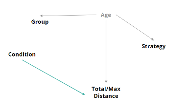

```{r setup, include=FALSE}
knitr::opts_chunk$set(echo = TRUE)
```

## Library data, data processing

```{r}
library (nlme)
library (lme4)
library(lmerTest)
library(mediation)
library(car)
library(GGally)
library(ggplot2)
library(dplyr)
library(purrr)
library(caret)
library(MASS)
```


```{r}
data <- read.csv("All_data_S.csv")
data <- subset(data,Strategy!=2)
data <- subset(data, TD <= 2000)
```

## CMA

### Mediation on Group

```{r}
library(lme4)
fit.mediator <- glmer (Strategy ~ group + condition + (1|subject), data = subset(data, Completion == 0 & condition %in% c(1, 2, 3, 4 )), family='binomial') 

fit.dv<- lmer(TD ~ group + Strategy + condition + age  + (1|subject), data = subset(data, Completion == 0& condition %in% c(1, 2, 3, 4))) 

results<-mediation::mediate(fit.mediator,fit.dv,treat='group',mediator='Strategy',control.value = 1, treat.value = 2) 

summary(results) 
```

Conclusion: Group haven't effect (include direct or indirect effect on Total Distance)

### Mediation on Condition

```{r}
library(mediation)
med.model.con <- glmer (Strategy ~ group + condition + (1|subject), data = subset (data, Completion == 0 & condition %in% c(1, 2, 3, 4 )), family='binomial') 

out.model.con<- lmer(TD ~ group + Strategy + condition + age + (1|subject), data = subset(data, Completion == 0& condition %in% c(1, 2, 3, 4))) 

 

med.out_real_con_12<-mediate(med.model.con,out.model.con,treat="condition",mediator="Strategy", boot=FALSE, sims=500, control.value =1, treat.value = 2)
med.out_real_con_13<-mediate(med.model.con,out.model.con,treat="condition",mediator="Strategy", boot=FALSE, sims=500,control.value =1, treat.value = 3)
med.out_real_con_14<-mediate(med.model.con,out.model.con,treat="condition",mediator="Strategy", boot=FALSE, sims=500,control.value =1, treat.value = 4)
med.out_real_con_23<-mediate(med.model.con,out.model.con,treat="condition",mediator="Strategy", boot= FALSE, sims=500,control.value =2, treat.value = 3)
med.out_real_con_24<-mediate(med.model.con,out.model.con,treat="condition",mediator="Strategy", boot= FALSE, sims=500,control.value =2, treat.value = 4)
med.out_real_con_34<-mediate(med.model.con,out.model.con,treat="condition",mediator="Strategy", boot= FALSE, sims=500,control.value =3, treat.value = 4)

```

### summary CMA on Condition

```{r}
summary(med.out_real_con_12)
summary(med.out_real_con_13)
summary(med.out_real_con_14)
summary(med.out_real_con_23)
summary(med.out_real_con_24)
summary(med.out_real_con_34)  
```

### Table CMA on Condition

|     | ACME  | ADE       |
|-----|-------|-----------|
| 12​  | 0.92​  | 2.00E-16​  |
| 13​  | 0.89​  | 2.00E-16​  |
| 14​  | 0.80​  | 2.00E-16​  |
| 23​  | 0.96​  | 2.00E-16​  |
| 24​  | 0.83​  | 2.00E-16​  |
| 34​  | 0.92​  | 2.00E-16​  |
| 12​  | 0.92​  | 2.00E-16​  |

Conclusion: Condition only has direct effect on Total Distance



## Three Model

### Whether do we need include random effect

```{r}
fit_include_ml <- lmer(TD ~ group + age + Strategy + condition + BMI + (1|subject), data = data, REML = FALSE)
fit_without_ml <- lm(TD ~ group + age + Strategy + BMI + condition, data = data) 
library(RLRsim)
exactLRT(fit_include_ml, fit_without_ml)
```

Based on this result (p is smaller than 0.05), we need to include random effect (it make sense).

We have done following models.

Basic Model : basic_model \<-lmer(TD \~ group + as.factor(condition) + age + Strategy + (1\|subject), data = data) Interaction Model : interaction_model \<-lmer(TD \~ group + as.factor(condition) + age + Strategy + group\*Strategy + (1\|subject), data = data) Polynomial Model : poly_model \<- lmer(TD \~ Strategy + group + as.factor(condition) + age + poly(age,2) + (1\|subject), data = data) \### Model establish

```{r}
basic_model<-lmer(TD ~ group + as.factor(condition) + age + Strategy + (1|subject), data = data)
interaction_model <-lmer(TD ~ group + as.factor(condition) + age + Strategy + group*Strategy + (1|subject), data = data)
poly_model <- lmer(TD ~ Strategy + group + as.factor(condition) + age + poly(age,2) + (1|subject), data = data)
```

### Model Performance

AIC, BIC ... and RMSE for all models we used.
Also the summary of the one with best performance

Train these three models with cross-validation:

For Basic Model:
```{r}
set.seed(123)
folds <- createFolds(data$subject, k = 5, list = TRUE, returnTrain = TRUE)
results <- list()
for(i in seq_along(folds)) {
  trainIndex <- folds[[i]]
  # Split the data into training and test sets
  trainData <- data[trainIndex, ]
  testData <- data[-trainIndex, ]
  # Fit the model on the training data
  model <-lmer(TD ~ group + as.factor(condition) + age + Strategy + group*Strategy + (1|subject), data = trainData)  # Predict on the test data
  predictions <- predict(model, newdata = testData)
  # Calculate the root mean squared error (RMSE)
  rmse <- sqrt(mean((predictions - testData$TD)^2))
  # Extract AIC and BIC
  aic <- AIC(model)
  bic <- BIC(model)
  # Store results
  results[[i]] <- list(RMSE = rmse, AIC = aic, BIC = bic)
  #Enable the following lines to see the residual plots#
  #plot(fitted(model), resid(model), xlab = "Fitted Values", ylab = "Residuals",
       #main = paste("Residual vs. Fitted Values - Fold", i))
  #abline(h = 0, col = "red")
}
# Calculate the average RMSE, AIC, and BIC across all folds
avg_rmse <- mean(sapply(results, function(x) x$RMSE))
avg_aic <- mean(sapply(results, function(x) x$AIC))
avg_bic <- mean(sapply(results, function(x) x$BIC))

cat(sprintf("Average RMSE: %f\n", avg_rmse))
cat(sprintf("Average AIC: %f\n", avg_aic))
cat(sprintf("Average BIC: %f\n", avg_bic))
```
For Interaction Model:
```{r}
set.seed(234)
folds <- createFolds(data$subject, k = 5, list = TRUE, returnTrain = TRUE)
results <- list()
for(i in seq_along(folds)) {
  trainIndex <- folds[[i]]
  # Split the data into training and test sets
  trainData <- data[trainIndex, ]
  testData <- data[-trainIndex, ]
  # Fit the model on the training data
  model<-lmer(TD ~ group + as.factor(condition) + age + Strategy + (1|subject), data = trainData)
  # Predict on the test data
  predictions <- predict(model, newdata = testData)
  # Calculate the root mean squared error (RMSE)
  rmse <- sqrt(mean((predictions - testData$TD)^2))
  # Extract AIC and BIC
  aic <- AIC(model)
  bic <- BIC(model)
  # Store results
  results[[i]] <- list(RMSE = rmse, AIC = aic, BIC = bic)
  #Enable the following lines to see the residual plots#
  #plot(fitted(model), resid(model), xlab = "Fitted Values", ylab = "Residuals",
       #main = paste("Residual vs. Fitted Values - Fold", i))
  #abline(h = 0, col = "red")
}
# Calculate the average RMSE, AIC, and BIC across all folds
avg_rmse <- mean(sapply(results, function(x) x$RMSE))
avg_aic <- mean(sapply(results, function(x) x$AIC))
avg_bic <- mean(sapply(results, function(x) x$BIC))

cat(sprintf("Average RMSE: %f\n", avg_rmse))
cat(sprintf("Average AIC: %f\n", avg_aic))
cat(sprintf("Average BIC: %f\n", avg_bic))
```

For Polynomial Model:
```{r}
set.seed(345)
folds <- createFolds(data$subject, k = 5, list = TRUE, returnTrain = TRUE)
results <- list()
for(i in seq_along(folds)) {
  trainIndex <- folds[[i]]
  # Split the data into training and test sets
  trainData <- data[trainIndex, ]
  testData <- data[-trainIndex, ]
  # Fit the model on the training data
  model <- lmer(TD ~ Strategy + group + as.factor(condition) + age + poly(age,2) + (1|subject), data = trainData)  # Predict on the test data
  predictions <- predict(model, newdata = testData)
  # Calculate the root mean squared error (RMSE)
  rmse <- sqrt(mean((predictions - testData$TD)^2))
  # Extract AIC and BIC
  aic <- AIC(model)
  bic <- BIC(model)
  # Store results
  results[[i]] <- list(RMSE = rmse, AIC = aic, BIC = bic)
  #Enable the following lines to see the residual plots#
  #plot(fitted(model), resid(model), xlab = "Fitted Values", ylab = "Residuals",
       #main = paste("Residual vs. Fitted Values - Fold", i))
  #abline(h = 0, col = "red")
}
# Calculate the average RMSE, AIC, and BIC across all folds
avg_rmse <- mean(sapply(results, function(x) x$RMSE))
avg_aic <- mean(sapply(results, function(x) x$AIC))
avg_bic <- mean(sapply(results, function(x) x$BIC))

cat(sprintf("Average RMSE: %f\n", avg_rmse))
cat(sprintf("Average AIC: %f\n", avg_aic))
cat(sprintf("Average BIC: %f\n", avg_bic))
```
We saw that based on the AIC and BIC, the polynomial model works the best(although the performance is still not acceptable enough based on the ratio: RMSE/Mean of TD = 0.225)

Thus, we try get the plots and summary of the polynomial model:
```{r}
plot(poly_model)
summary(poly_model)
polbasic<-resid(poly_model)
qqnorm(polbasic)
qqline(polbasic)
```

From the residual plot, we find that as the fitted value becomes larger, the residuals become more and more dispersed. From the qq plot, it shows the residuals is not normally distributed.
Moreover, the p-value here also tells us that probably the condition and age are the only two significant variables

## EDA

Because the results of various edits to the model are not very good (in addition to the above model, we have also tried to convert the model, but the effect is not satisfactory), we try to check each variable in the data.

```{r}
library(ggplot2)
library(dplyr)
data_EDA <- data %>%
  group_by(subject) %>%
  summarise(BMI = mean(BMI, na.rm = TRUE), 
            mean_TD = mean(TD, na.rm = TRUE),
            Age = mean(age,na.rm = TRUE))
```

### BMI -\> TD

```{r}
ggplot(data_EDA) +
  aes(x = BMI, y = mean_TD) +
  geom_point(shape = "circle", size = 1.5, colour = "#112446") +
  geom_smooth(span = 0.75) +
  labs(title = "BMI to Total Distance") +
  theme_minimal()
```

The confidence interval on the right side of the curve is too large, and the rise on the right end is basically caused by one person. We can think that there is no linear relationship between BMI and TD.

### Age -\> TD

```{r}
ggplot(data_EDA) +
  aes(x = Age, y = mean_TD) +
  geom_point(shape = "circle", size = 1.5, colour = "#112446") +
  geom_smooth(span = 0.75) +
  labs(title = "Age to Total Distance") +
  theme_minimal()
```

There may be a relationship between Age and TD

### Strategy -\> TD

```{r}
data_factor <- data |>
  mutate("Strategy" = as.factor(Strategy),
         "Condition" = as.factor(condition))
ggplot(data_factor) +
  aes(x = Strategy, y = TD) +
  geom_boxplot(fill = "#112446") +
  labs(title = "Strategy to TD") +
  theme_minimal()
```

There do not appear to be strong relationships between Strategy and TD.

### Condition -\> TD

```{r}
ggplot(data_factor) +
  aes(x = Condition, y = TD) +
  geom_boxplot(fill = "#112446") +
  labs(title = "Condition to TD") +
  theme_minimal()
```

There may be a relationship between Condition and TD, but it is not obvious.

Based on the above results, it appears that we cannot achieve a more accurate alignment with the current samples and variables at hand. Here are some strategies you might consider to enhance the fitting:

Increase the sample size. Adjust the sampling interval. Add new variables or modify existing ones.

## Code

```{r}
```
